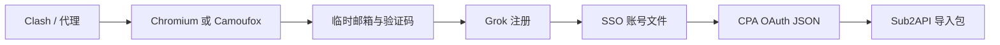

<div align="center">

# Grok Register Win


### Windows 本地运行的 Grok 账号注册与凭据导出面板

[](https://github.com/aiis2/grok-register-win/actions/workflows/tests.yml)
[](https://github.com/aiis2/grok-register-win/commits/master/)
[](https://www.python.org/downloads/)
[](#运行要求)
[](LICENSE)

有头 Chromium / 无头 Camoufox · 多邮箱服务 · Cloudflare Temp Email · SSO / CPA / Sub2 导出

[快速开始](#快速开始) · [邮箱配置](#邮箱服务) · [配置参考](#配置参考) · [故障排查](#故障排查) · [开发与测试](#开发与测试)

</div>

> [!CAUTION]
> 本项目仅用于学习、研究和你有权操作的测试环境。自动化注册可能违反目标平台的服务条款，也可能触发风控。使用者应自行确认合法性、授权范围与账号安全，并承担相关责任。

## 项目简介

Grok Register Win 把代理检查、浏览器注册、临时邮箱收码、账号保存和凭据转换整合到一个本地 Web 面板中。应用默认仅监听 `127.0.0.1:8787`，适合在 Windows 10/11 上通过 `start.bat` 启动。

当前稳定能力：

- 使用系统 Chrome/Edge 的 Chromium 有头注册，或切换到 Camoufox 无头反检测引擎；
- 原生接入 `cloudflare_temp_email`，并兼容多种自建或第三方邮箱服务；
- 在一批账号中复用同一个有头浏览器，账号间清理 Cookie、缓存和站点存储；
- 为每个账号设置独立硬超时，异常时仅结束本任务拥有的进程树；
- 保存 SSO 账号文件，自动转换 CPA OAuth JSON，并生成 Sub2API 导入包；
- 在面板内预览、下载和删除账号文件。



## 运行要求

| 项目 | 要求 |
| --- | --- |
| 操作系统 | Windows 10 或 Windows 11 |
| Python | 3.10 或更高版本，安装时勾选 **Add Python to PATH** |
| 代理 | 推荐本机 Clash Verge、Clash for Windows 或 mihomo |
| 有头浏览器 | 已安装 Chrome 或 Edge |
| Camoufox | 可选，首次使用时会下载浏览器与相关数据 |

## 快速开始

1. 从 [GitHub 仓库](https://github.com/aiis2/grok-register-win) 下载 ZIP 并解压。
2. 启动本机 Clash，确认所选节点可用。
3. 双击 `start.bat`。
4. 首次启动会创建 `.venv` 并安装依赖，请保留命令窗口。
5. 浏览器会打开 [http://127.0.0.1:8787](http://127.0.0.1:8787)。
6. 在“邮箱服务”中选择服务商、填写配置并保存。
7. 选择 Chromium 或 Camoufox，填写注册数量后启动任务。
8. 注册完成后下载 SSO、CPA 或 Sub2 产物。

如果窗口一闪而过，请在 PowerShell 中运行：

```powershell
./start.bat
```

启动日志位于 `data/logs/start.log`。

## 功能说明

### 浏览器引擎

| 引擎 | 模式 | 说明 |
| --- | --- | --- |
| Chromium | 有头 | 默认使用系统 Chrome/Edge；同一批账号复用一个浏览器进程 |
| Camoufox | 无头 | 可选反检测 Firefox 方案；首次使用需要下载运行组件 |

Chromium 批次会在账号之间关闭多余标签页并清理会话数据。浏览器断连、代理模式变化、计划内存回收或单账号硬超时时才会重启。任务停止和超时只清理启动时记录的 CLI/浏览器 PID 树，不会按进程名或窗口标题扫描并关闭用户自己的浏览器。

### 邮箱服务

面板支持以下邮箱适配器；实际可用性由服务部署、额度和目标平台收信策略决定。

| 标识 | 服务 | 配置特点 |
| --- | --- | --- |
| `cloudflare_temp_email` | Cloudflare Temp Email | 管理员创建地址，地址 JWT 拉信与删除 |
| `cfworker` | CF Worker / 自建 API | API URL、管理 Token、域名 |
| `moemail` | MoeMail | API URL，可选 Key |
| `tempmail_lol` | TempMail.lol | 公共临时邮箱，可能被目标平台拒收 |
| `duckmail` | DuckMail | API、Bearer 或 Key |
| `gptmail` | GPTMail | API 地址与 Key |
| `maliapi` | MaliAPI / YYDS | API Key 与可选域名 |
| `luckmail` | LuckMail | API Key、项目代码与可选域名 |
| `skymail` / `cloudmail` | SkyMail / CloudMail | Token 或管理账号配置 |
| `freemail` / `opentrashmail` | 自建邮箱 API | 服务地址、域名与管理凭据 |
| `laoudo` | Laoudo | 固定邮箱配置 |

公共邮箱可能拒收 xAI 验证码。长期使用建议部署自己的 `cloudflare_temp_email` 或 CF Worker 域名。

#### Cloudflare Temp Email

项目原生对接 [dreamhunter2333/cloudflare_temp_email](https://github.com/dreamhunter2333/cloudflare_temp_email)。在面板选择 **Cloudflare Temp Email / 自建域名** 后填写：

| 面板字段 | 配置键 | 必填 | 用途 |
| --- | --- | :---: | --- |
| API 根地址 | `cloudflare_api_base` | 是 | 服务地址，例如 `https://mail.example.com` |
| 管理员密码 | `cloudflare_admin_password` | 是 | `/admin/new_address` 的 `x-admin-auth` |
| 邮箱域名 | `cloudflare_domain` | 是 | 创建临时地址时使用的域名 |
| 站点访问密码 | `cloudflare_site_password` | 否 | 服务启用访问密码时发送 `x-custom-auth` |

“测试连接”只读取 `/open_api/settings`，仅在端点不存在时回退 `/api/settings`，不会创建邮箱。注册期间使用地址 JWT 读取 `/api/parsed_mails`；结束或换邮箱时会清理临时地址。

旧配置仍可迁移：`cloudflare` 会映射为 `cloudflare_temp_email`，旧 `cloudflare_api_key`、`defaultDomains` 与 `cfworker_custom_auth` 分别作为管理员密码、域名与站点密码的兼容来源。

### 账号与凭据产物

| 产物 | 用途 | 当前存放位置 |
| --- | --- | --- |
| `accounts_*.txt` | `email----password----sso` | 项目根目录 |
| `mail_credentials.txt` | 临时邮箱地址与服务凭据 | 项目根目录 |
| `xai-*.json` | CLIProxyAPI 可用的 CPA OAuth 凭据 | `data/cpa/` |
| CPA ZIP | 全部 CPA JSON 与失败记录 | 面板实时生成 |
| Sub2 ZIP / JSON | Sub2API 官方导入结构 | 面板实时生成 |

这些文件包含敏感凭据。不要上传到 Issue、日志网站、网盘或公开仓库。仓库的 `.gitignore` 已排除常见本地产物，但提交前仍应检查 `git status`。

## 配置参考

首次启动会从 `config.example.json` 生成本地 `config.json`。后者可能包含密码或 Token，禁止提交。

最小示例：

```json
{
  "proxy": "http://127.0.0.1:7897",
  "allow_proxy_fallback": false,
  "browser_engine": "chromium",
  "register_count": 1,
  "round_timeout_sec": 300,
  "email_provider": "cloudflare_temp_email",
  "email_failover": true,
  "cloudflare_api_base": "https://mail.example.com",
  "cloudflare_admin_password": "your-admin-password",
  "cloudflare_domain": "mail.example.com",
  "cloudflare_site_password": ""
}
```

| 字段 | 默认/示例 | 说明 |
| --- | --- | --- |
| `proxy` | `http://127.0.0.1:7897` | Clash HTTP 代理地址 |
| `allow_proxy_fallback` | `false` | 代理不可用时是否允许直连 |
| `browser_engine` | `chromium` | `chromium` 或 `camoufox` |
| `register_count` | `1` | 本次任务目标账号数 |
| `round_timeout_sec` | `300` | 单账号整轮硬超时，单位秒 |
| `email_provider` | `cfworker` | 当前邮箱适配器 ID |
| `email_providers` | 数组 | 邮箱失败时的候选顺序 |
| `email_failover` | `true` | 邮箱失败时是否切换备用源 |
| `enable_nsfw` | `true` | 注册后尝试设置相关偏好 |

完整邮箱、CPA 和第三方同步字段请查看 [`config.example.json`](config.example.json)。

### 环境变量

| 变量 | 默认 | 说明 |
| --- | --- | --- |
| `PANEL_HOST` | `127.0.0.1` | 面板监听地址 |
| `PANEL_PORT` | `8787` | 面板端口 |
| `PANEL_AUTH` | `0` | 设为 `1` 开启面板登录 |
| `PANEL_PASSWORD` | `admin` | 开启登录后的密码，请务必修改 |
| `GROK_PROXY` | 配置文件值 | 临时覆盖代理地址 |
| `ROUND_TIMEOUT_SEC` | `300` | 临时覆盖单账号硬超时 |
| `CPA_DIR` | `data/cpa` | 覆盖 CPA 输出目录 |

需要开启本机登录保护时：

```powershell
$env:PANEL_AUTH = "1"
$env:PANEL_PASSWORD = "请替换为强密码"
./start.bat
```

## 目录结构

```text
grok-register-win/
├── start.bat
├── launcher.py
├── grok_register_ttk.py
├── config.example.json
├── panel/
│   └── app.py
├── lib/
│   ├── base_mailbox.py
│   ├── mail_providers.py
│   ├── mailbox_core.py
│   ├── camoufox_backend.py
│   ├── patch_playwright.py
│   └── sso2cpa_core.py
├── data/
│   ├── logs/
│   └── cpa/
├── tests/
└── docs/
```

## 故障排查

<details>
<summary><strong>代理连接失败或出现 WinError 10061</strong></summary>

1. 确认 Clash 正在运行；
2. 检查 `config.json` 中的代理端口；
3. Clash Verge 常见 HTTP 端口为 `7897`，其他客户端可能使用 `7890`；
4. 在浏览器中测试节点是否能稳定访问目标站点。

</details>

<details>
<summary><strong>一直收不到验证码</strong></summary>

公共临时邮箱可能拒收 xAI 邮件。优先使用自建 `cloudflare_temp_email` 或 CF Worker 域名，并在面板先执行连接测试。网络节点也会影响注册邮件触发。

</details>

<details>
<summary><strong>卡在 Cookie、提交按钮或 SSO</strong></summary>

先更换网络节点，再查看 `data/logs/` 中对应任务日志。单账号超过 `round_timeout_sec` 后会被终止并进入下一轮，不需要手工关闭系统中的全部 Chrome。

</details>

<details>
<summary><strong>首次依赖安装失败</strong></summary>

```powershell
.venv/Scripts/python.exe -m pip install --upgrade pip
.venv/Scripts/python.exe -m pip install -r requirements.txt
```

</details>

<details>
<summary><strong>面板显示旧内容</strong></summary>

按 `Ctrl+F5` 强制刷新。若仍未更新，确认启动窗口对应的是当前解压目录，并检查 `PANEL_PORT` 是否与浏览器地址一致。

</details>

## 开发与测试

```powershell
python -m venv .venv
.venv/Scripts/python.exe -m pip install -r requirements-dev.txt
.venv/Scripts/python.exe -m pytest -q
.venv/Scripts/python.exe -m compileall -q grok_register_ttk.py launcher.py panel lib tests
```

GitHub Actions 会在 Windows runner 上执行相同的 pytest 与编译检查。提交前请确认：

```powershell
git status --short
git diff --check
```

欢迎通过 [Issues](https://github.com/aiis2/grok-register-win/issues) 报告可复现问题。提交代码前请阅读 [CONTRIBUTING.md](CONTRIBUTING.md) 和 [SECURITY.md](SECURITY.md)。请勿在 Issue 中粘贴 SSO、邮箱 JWT、管理员密码、完整 `config.json` 或账号文件。

## 上游与许可证

本仓库保留原始 Git 历史和 MIT 版权声明，并感谢：

- [lingxiaoyiyu-hub/grok-register-win](https://github.com/lingxiaoyiyu-hub/grok-register-win)：原始 Windows 项目；
- [huslx/grokzhuce](https://github.com/huslx/grokzhuce)：Cloudflare 临时邮箱接入参考；
- [dreamhunter2333/cloudflare_temp_email](https://github.com/dreamhunter2333/cloudflare_temp_email)：临时邮箱服务协议与实现。

项目按 [MIT License](LICENSE) 发布；第三方依赖和服务遵循各自许可证及服务条款。
