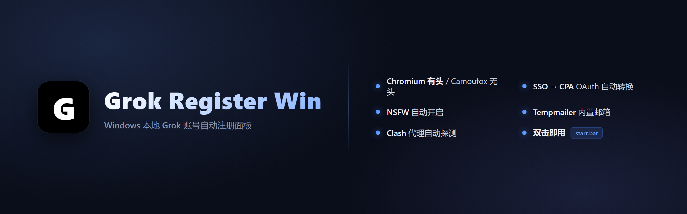
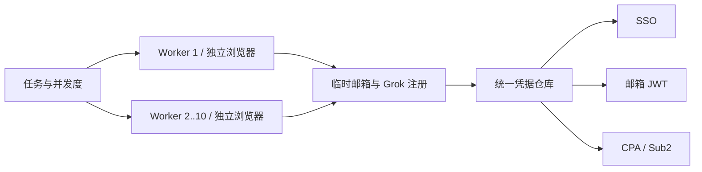

<div align="center">

# Grok Register Win



### Windows 本地运行的 Grok 账号注册与凭据导出面板

[](https://github.com/aiis2/grok-register-win/actions/workflows/tests.yml)
[](https://github.com/aiis2/grok-register-win/releases/tag/v1.10.1)
[](https://www.python.org/downloads/)
[](#运行要求)
[](LICENSE)

1–10 并发注册 · 隐藏有头 Chromium · Cloudflare Temp Email · 端到端收件验证 · 可迁移凭据仓库 · SSO 全量换票 · CPA / Sub2 导出

[快速开始](#快速开始) · [并发注册](#并发注册与资源模型) · [凭据迁移](#修改或迁移凭据目录) · [邮箱配置](#邮箱服务) · [故障排查](#故障排查)

</div>

> [!CAUTION]
> 本项目仅用于学习、研究和你有权操作的测试环境。自动化注册可能违反目标平台的服务条款，也可能触发风控。使用者应自行确认合法性、授权范围与账号安全，并承担相关责任。

## 项目简介

Grok Register Win 把代理检查、浏览器注册、临时邮箱收码、账号保存和凭据转换整合到一个本地 Web 面板中。应用默认仅监听 `127.0.0.1:8787`，适合在 Windows 10/11 上通过 `start.bat` 启动。

当前稳定能力：

- 默认使用现代化本地面板，按概览、注册与日志、账号、邮箱和凭据五个分区组织，并支持跟随系统、浅色和深色主题；
- 使用系统 Chrome/Edge 的 Chromium 有头注册，并可选择隐藏、最小化或正常显示；隐藏模式精确识别真实主窗口、不占任务栏且不是无头浏览器；
- 原生接入 `cloudflare_temp_email`，并兼容多种自建或第三方邮箱服务；
- 在 UI 中对当前邮箱配置执行端到端收件验证，按原生 API、SMTP Relay、可选 Direct MX 自动选择发件链路；
- 单次任务支持 `1–10000` 轮注册，并支持 `1–10` 个固定注册槽；每槽独占 CLI 进程、有头浏览器、调试端口和临时 Profile；
- 槽内复用同一个健康 Chromium，账号间清理 Cookie、缓存和站点存储；面板可按 worker 手动显示或隐藏当前窗口；
- Chromium 在最终资料页会以有界、非阻塞方式处理 Turnstile 的嵌套 Shadow DOM 控件；长时间无 token 时仍按既有上限 reset 并仅重启当前槽；
- 为每个账号设置独立硬超时；一个槽异常只重启该槽，停止任务只结束本任务登记的进程树；
- 将 SSO、邮箱 JWT 与 CPA 文件统一保存到可配置的凭据目录，并可在面板中安全迁移；
- 自动转换 CPA OAuth JSON，并生成 Sub2API 导入包；
- 可在新版或经典界面用已有 Web SSO 全量刷新 OAuth/CPA，最多一次排队 `10000` 个；成功原子替换，失败保留旧 CPA；
- 在面板内分页搜索账号并预览、下载和删除批次文件；账号列表接口不会返回密码、SSO 或 OAuth Token；
- 通过可断点续传的 SSE 实时显示脱敏日志，使用有界窗口和批量刷新避免大量注册后打开日志卡死，连接持续失败时自动回退到任务状态轮询。



## 运行要求

| 项目 | 要求 |
| --- | --- |
| 操作系统 | Windows 10 或 Windows 11 |
| Python | 3.10 或更高版本，安装时勾选 **Add Python to PATH** |
| 代理 | 推荐本机 Clash Verge、Clash for Windows 或 mihomo |
| 有头浏览器 | 已安装 Chrome 或 Edge |
| Camoufox | 可选，首次使用时会下载浏览器与相关数据 |

## 快速开始

1. 从 [GitHub 仓库](https://github.com/aiis2/grok-register-win) 下载 ZIP 并解压。
2. 启动本机 Clash，确认所选节点可用。
3. 双击 `start.bat`。
4. 首次启动会创建 `.venv` 并安装依赖，请保留命令窗口。
5. 浏览器会打开 [http://127.0.0.1:8787](http://127.0.0.1:8787)。
6. 在“邮箱服务”中选择服务商、填写配置并保存。
7. 选择 Chromium 或 Camoufox；使用 Chromium 时再选择隐藏、最小化或正常显示，然后填写 `1–10000` 的注册轮数和 `1–10` 的并发度并启动任务。
8. 在 Worker Process Matrix 中查看每个浏览器槽的范围、PID、当前轮次和结果；隐藏模式下可对当前 worker 手动点击“显示浏览器”或“隐藏浏览器”。
9. 注册完成后下载 SSO、CPA 或 Sub2 产物；需要改变保存位置时，在“凭据仓库”中保存或迁移。

默认地址打开新版面板。如升级后需要临时使用原界面，访问 [http://127.0.0.1:8787/?ui=legacy](http://127.0.0.1:8787/?ui=legacy)；该入口不会修改配置或凭据。

如果窗口一闪而过，请在 PowerShell 中运行：

```powershell
./start.bat
```

启动日志位于 `data/logs/start.log`。

## 功能说明

### 现代面板与经典回退

新版面板不依赖 Node.js、npm、外部 CDN 或前端构建步骤，仍由 Flask 直接提供本地 HTML、CSS 和 JavaScript。默认入口 `/` 与显式入口 `/?ui=modern` 均显示新版，`/?ui=legacy` 始终保留经典界面，便于升级期间快速回退。

| 分区 | 主要能力 |
| --- | --- |
| 概览 | 任务状态、成功/失败、并发、账号与 CPA 摘要、最近错误 |
| 注册与日志 | `1–10000` 轮、`1–10` 并发、浏览器模式、Worker 窗口显隐、停止任务、SSE 实时日志、暂停、自动滚动和级别/关键词过滤 |
| 账号 | 服务端搜索、来源/CPA 状态过滤、排序、`25/50/100` 分页、批次导入与导出 |
| 邮箱 | 全部邮箱适配器、安全密钥保存、连接测试、发件能力检查和端到端收件验证 |
| 凭据 | 统一存储目录、容量统计、手动迁移、CPA 队列、补转与全部 SSO 刷新 |

主题支持“跟随系统 / 浅色 / 深色”，只在浏览器保存显示偏好。账号搜索请求只返回邮箱、来源、时间和 CPA 就绪状态；密码、SSO、OAuth Token 与邮箱管理密钥不会进入新版账号列表、DOM 或浏览器存储。日志在浏览器中最多保留 2000 条，默认只绘制最近 300 条，可按 300 条逐步加载更早记录；清空按钮只清除当前页面显示，不删除服务端任务日志。旧版 `#logs` 深链会自动打开“注册与日志”并定位到日志区域。

升级时保留本地 `config.json`、`data/credentials/` 和 `data/logs/`，替换程序文件后重新运行 `start.bat` 即可，不需要编译前端。若新版界面出现兼容问题，可直接切换到 `/?ui=legacy` 继续操作；需要回退整个程序版本时，先停止当前面板，再恢复上一版本程序文件，继续复用原配置和凭据目录。

### 浏览器引擎

| 引擎 | 模式 | 说明 |
| --- | --- | --- |
| Chromium | 有头 | 默认使用系统 Chrome/Edge；每个并发槽独占浏览器，槽内账号复用根进程；支持隐藏、最小化和正常显示 |
| Camoufox | 无头 | 可选反检测 Firefox 方案；首次使用需要下载运行组件 |

Chromium 为每个 worker 分配互不重叠的调试端口段，并在系统临时目录使用包含 `worker + Python PID` 的独立 Profile。账号之间会关闭多余标签页并清理会话数据；浏览器断连、代理模式变化、计划内存回收或单账号硬超时时才会重启。任务停止和超时只清理面板登记的 CLI/浏览器 PID 树，不会按进程名或窗口标题扫描并关闭用户自己的浏览器。

#### Chromium 窗口模式

| `browser_window_mode` | Windows 行为 | 适用场景 |
| --- | --- | --- |
| `hidden` | 默认。启动完整的有头 Chromium，但原生窗口隐藏并从任务栏移除；后台页面和 Turnstile 仍使用有头浏览器能力 | 注册时不打断当前桌面操作 |
| `minimized` | 有头窗口保持最小化并出现在任务栏 | 需要随时从任务栏打开窗口 |
| `visible` | 按普通有头窗口显示 | 调试页面或人工观察注册过程 |

`hidden` **不是 headless 模式**，启动参数中不会加入 `--headless`。程序先以 Chromium DevTools Protocol 创建不抢焦点的后台窗口，再按本次启动的精确 PID 优先选择真实主窗口 `Chrome_WidgetWin_1`；只有兼容环境缺少该类窗口时，才回退到可见、非工具窗且具有有效尺寸的 Chromium 顶层窗口。首次隐藏后还会进行有界稳定扫描，把延迟出现或被替换的主窗口一并隐藏。最终只登记和控制该 worker 的 `PID + HWND`，窗口带 `WS_EX_TOOLWINDOW`、移除 `WS_EX_APPWINDOW`，目标 PID 下不保留可见主窗口或任务栏入口。

如果当前 Chromium 版本或本机环境无法完成静默引导，会结束本次未完成的精确进程树并安全降级到 `minimized`，Worker 卡片显示“已安全降级”；不会改成无头浏览器。

Worker 卡片只在任务运行且窗口归属有效时显示控制按钮。点击“显示浏览器”会先隐藏其他已登记的 worker 窗口，再显式激活所选窗口；点击“隐藏浏览器”会再次移除其任务栏入口。每次控制前后都会核对 worker、浏览器代次、PID 和 HWND，浏览器重启后的旧句柄会被拒绝，用户自行打开的 Chrome 不在控制范围内。任务结束后该 worker 的浏览器立即退出，不跨任务常驻。

### 并发注册与资源模型

`register_concurrency` 支持 `1–10`。任务会先把全局账号序号切成连续且不重叠的固定分片，再为每个非空分片启动一个 worker。例如，10 个账号、并发 3 会分为 `1–4`、`5–7`、`8–10`。

- 每个槽同时最多拥有一个 CLI 子进程和一个浏览器根进程；
- 同一槽的账号连续执行，健康浏览器直接复用，不会每个账号新开一个 Chrome；
- 某槽超时后只结束自己的进程树，并从该槽尚未完成的序号继续；
- 全局结果按账号序号去重，一个槽失败不会取消其他槽；
- 点击“停止”会对当前登记的所有 worker 各发送一次精确进程树终止。

有头浏览器的内存占用会随并发数近似增加。建议先从低并发开始，并结合任务管理器调整：

| 可用内存 | 建议起始并发 | 说明 |
| --- | :---: | --- |
| 8 GB 或以下 | 1–2 | 最稳妥，避免浏览器换页时触发系统换页文件 |
| 16 GB | 2–4 | 适合常规批量任务 |
| 32 GB | 4–6 | 先观察 Chrome 与 Python 总内存再提高 |
| 64 GB 及以上 | 6–10 | 仍受代理、CPU、邮箱服务和目标站点风控限制 |

这只是保守起点，不代表成功率会随并发线性提升。代理出口和邮箱服务通常比 CPU 更早成为瓶颈。

### 邮箱服务

面板支持以下邮箱适配器；实际可用性由服务部署、额度和目标平台收信策略决定。

| 标识 | 服务 | 配置特点 |
| --- | --- | --- |
| `cloudflare_temp_email` | Cloudflare Temp Email | 管理员创建地址，地址 JWT 拉信与删除 |
| `cfworker` | CF Worker / 自建 API | API URL、管理 Token、域名 |
| `moemail` | MoeMail | API URL，可选 Key |
| `tempmail_lol` | TempMail.lol | 公共临时邮箱，可能被目标平台拒收 |
| `duckmail` | DuckMail | API、Bearer 或 Key |
| `gptmail` | GPTMail | API 地址与 Key |
| `maliapi` | MaliAPI / YYDS | API Key 与可选域名 |
| `luckmail` | LuckMail | API Key、项目代码与可选域名 |
| `skymail` / `cloudmail` | SkyMail / CloudMail | Token 或管理账号配置 |
| `freemail` / `opentrashmail` | 自建邮箱 API | 服务地址、域名与管理凭据 |
| `laoudo` | Laoudo | 固定邮箱配置 |

公共邮箱可能拒收 xAI 验证码。长期使用建议部署自己的 `cloudflare_temp_email` 或 CF Worker 域名。

#### 通用邮箱收件验证

“测试收件”对所有当前已接入的邮箱适配器开放，不再只检查某个固定 API 是否能连接。点击按钮后，模态框会先用当前页面中尚未保存的配置探测发件能力；确认开始后会创建一次性邮箱、记录旧邮件快照、发送随机 Grok 格式验证码，再调用与注册流程相同的 `wait_for_code()` 读取并精确比对。

自动模式严格按 **原生 API → SMTP → Direct MX** 选择第一个可用策略：

| 策略 | 可用条件 | 说明 |
| --- | --- | --- |
| 原生 API | 当前邮箱适配器具有已知发件 API 且账号允许发件 | 首期支持 Freemail `/api/send`；不会猜测未知服务的接口路径 |
| SMTP Relay | 配置主机、端口、发件地址；认证账号和密码必须同时存在或同时留空 | 支持 SSL/TLS、STARTTLS 和 Plain；每次只允许向本次生成的测试邮箱投递 |
| Direct MX | 用户显式勾选启用 | 从测试邮箱域名查询 MX，只连接查询结果的 25 端口，不接受任意目标主机 |

Direct MX 默认关闭。家庭网络、云厂商或收件服务器可能封锁 25 端口；缺少 DKIM/SPF 的匿名邮件也可能被拒收或进入垃圾箱。因此它只作为明确知晓限制时的最后回退，不替代正规的 SMTP 服务。

模态框按 `checking → creating → snapshotting → sending → waiting → verifying → cleaning → succeeded` 展示进度。发送失败、等待超时、验证码不匹配和清理失败都会显示发生阶段与可操作的错误；取消和失败路径仍会尝试清理已经创建的测试邮箱。界面和状态 API 不返回测试验证码，Freemail/SMTP 密码不会回显，错误内容会移除密码、Bearer Token、Cookie、完整测试邮箱与验证码。

#### Freemail

Freemail 可以在页面填写 API URL、管理员用户名/密码或 Admin Token，也可以只使用 Windows/进程环境变量：

| 环境变量 | 对应配置 | 说明 |
| --- | --- | --- |
| `MAIL_WEB_URL` | `freemail_api_url` | Freemail 服务根地址，例如 `https://mail.example.com`；不要附加 `/api` |
| `ADMIN_NAME` | `freemail_username` | 管理员用户名 |
| `ADMIN_PASSWORD` | `freemail_password` | 管理员密码 |

页面配置优先尝试；若已保存的 Admin Token 或账号密码返回 401/403，适配器会自动尝试完整的 `ADMIN_NAME` / `ADMIN_PASSWORD` 环境变量组合。API URL 会自动规范化为站点根地址，误填的一个或多个末尾 `/api` 会被移除。配置页可勾选“使用 Windows 环境变量”，保存时清除页面 URL、Token、用户名和密码。环境变量只在运行时合并，不会写入 `config.json`；Admin Token 与密码均不通过配置 API 回显。原生发件测试还要求 Freemail 登录响应中的 `can_send` 已开启，并且服务端配置了可用发件渠道。

#### Cloudflare Temp Email

项目原生对接 [dreamhunter2333/cloudflare_temp_email](https://github.com/dreamhunter2333/cloudflare_temp_email)。在面板选择 **Cloudflare Temp Email / 自建域名** 后填写：

| 面板字段 | 配置键 | 必填 | 用途 |
| --- | --- | :---: | --- |
| API 根地址 | `cloudflare_api_base` | 是 | 服务地址，例如 `https://mail.example.com` |
| 管理员密码 | `cloudflare_admin_password` | 是 | `/admin/new_address` 的 `x-admin-auth` |
| 邮箱域名 | `cloudflare_domain` | 是 | 创建临时地址时使用的域名 |
| 站点访问密码 | `cloudflare_site_password` | 否 | 服务启用访问密码时发送 `x-custom-auth` |

“测试连接”只读取 `/open_api/settings`，仅在端点不存在时回退 `/api/settings`，不会创建邮箱。注册期间使用地址 JWT 读取 `/api/parsed_mails`；结束或换邮箱时会清理临时地址。

旧配置仍可迁移：`cloudflare` 会映射为 `cloudflare_temp_email`，旧 `cloudflare_api_key`、`defaultDomains` 与 `cfworker_custom_auth` 分别作为管理员密码、域名与站点密码的兼容来源。

### 账号与凭据产物

默认根目录为 `data/credentials`，也可以在面板中改成应用内相对路径或其他磁盘的绝对路径。

| 产物 | 用途 | 默认存放位置 |
| --- | --- | --- |
| `accounts_*_w<id>_<pid>_*.txt` | `email----password----sso` | `data/credentials/sso/` |
| `mail_credentials_*_w<id>_<pid>_*.txt` | 临时邮箱地址与服务 JWT | `data/credentials/mail/` |
| `xai-*.json` | CLIProxyAPI 可用的 CPA OAuth 凭据 | `data/credentials/cpa/` |
| CPA ZIP | 全部 CPA JSON 与失败记录 | 面板实时生成 |
| Sub2 ZIP / JSON | Sub2API 官方导入结构 | 面板实时生成 |

这些文件包含敏感凭据。不要上传到 Issue、日志网站、网盘或公开仓库。仓库的 `.gitignore` 已排除常见本地产物，但提交前仍应检查 `git status`。

#### 修改或迁移凭据目录

面板“凭据仓库”提供两种操作：

- **保存新路径**：适用于当前没有凭据，且目标目录为空的情况；
- **迁移并切换**：将当前目录及历史位置中的 SSO、邮箱 JWT、CPA 数据一起迁移。

迁移事务按以下顺序执行：

1. 将全部候选文件复制到目标目录的同目录临时文件；
2. 对来源和副本计算 SHA-256，全部一致后才继续；
3. 原子更新 `config.json` 中的 `credentials_dir`；
4. 删除已验证的来源文件；删除失败会保留文件并在 UI 返回 warning。

不会覆盖现有文件：同名同内容会跳过副本并清理来源；同名不同内容会保存为 `原名-migrated-时间戳.ext`。复制或校验失败时不会切换配置，也不会删除来源。

从 v1.3 或更早版本升级时，直接在面板输入目标目录并点击“迁移并切换”。迁移器会同时识别：

- 项目根目录的 `accounts_*.txt`；
- 项目根目录的 `mail_credentials*.txt`；
- 历史 `data/cpa/` 中的 `xai-*.json`、`index.json` 和 `failed.jsonl`；
- 当前已配置凭据目录中的对应文件。

注册任务或 CPA 转换队列运行时，保存和迁移会被拒绝。若显式设置了 `CPA_DIR` 环境变量，请先取消该覆盖，再使用统一迁移。

#### 刷新已有 SSO 的 OAuth/CPA

在新版面板进入“凭据 → CPA 转换”，点击“刷新全部 SSO 换票”；经典界面提供同名回退按钮。该操作使用当前账号池里已经保存的 Web SSO 重新换取 OAuth/CPA，**不会生成新的 Web SSO**。处理上限支持 `1–10000`，任务继续复用单线程 CPA 队列，避免同时对同一 SSO 发起重复换票。

- 已完成的 SSO 可强制重新换票，已在处理中的 SSO 会安全跳过；
- 成功结果通过同目录临时文件原子替换现有 CPA；
- 换票或写入失败时不删除、不截断旧 CPA，并在状态与脱敏日志中展示错误；
- 注册任务、凭据导入或凭据迁移正在切换时，刷新请求返回明确的忙碌提示；
- API 和页面只返回总数、入队数、跳过数与公共队列状态，不返回 SSO、密码或 OAuth Token。

## 配置参考

首次启动会从 `config.example.json` 生成本地 `config.json`。后者可能包含密码或 Token，禁止提交。

最小示例：

```json
{
  "proxy": "http://127.0.0.1:7897",
  "allow_proxy_fallback": false,
  "browser_engine": "chromium",
  "browser_window_mode": "hidden",
  "register_count": 1,
  "register_concurrency": 1,
  "credentials_dir": "data/credentials",
  "round_timeout_sec": 300,
  "email_provider": "cloudflare_temp_email",
  "email_failover": true,
  "cloudflare_api_base": "https://mail.example.com",
  "cloudflare_admin_password": "your-admin-password",
  "cloudflare_domain": "mail.example.com",
  "cloudflare_site_password": ""
}
```

| 字段 | 默认/示例 | 说明 |
| --- | --- | --- |
| `proxy` | `http://127.0.0.1:7897` | Clash HTTP 代理地址 |
| `allow_proxy_fallback` | `false` | 代理不可用时是否允许直连 |
| `browser_engine` | `chromium` | `chromium` 或 `camoufox` |
| `browser_window_mode` | `hidden` | Chromium 有头窗口模式：`hidden`、`minimized` 或 `visible`；非 Windows 环境的 `hidden` 会规范化为 `visible` |
| `register_count` | `1` | 本次任务目标账号数 |
| `register_concurrency` | `1` | 固定注册槽数量，范围 `1–10` |
| `credentials_dir` | `data/credentials` | SSO、邮箱 JWT 与 CPA 的统一根目录 |
| `round_timeout_sec` | `300` | 单账号整轮硬超时，单位秒 |
| `email_provider` | `cfworker` | 当前邮箱适配器 ID |
| `email_providers` | 数组 | 邮箱失败时的候选顺序 |
| `email_failover` | `true` | 邮箱失败时是否切换备用源 |
| `mail_test_sender_mode` | `auto` | `auto`、`native`、`smtp` 或 `direct_mx` |
| `mail_test_timeout_sec` | `90` | 测试邮件收件等待，范围 `15–300` 秒 |
| `mail_test_smtp_host` / `mail_test_smtp_port` | 空 / `587` | SMTP Relay 地址与端口 |
| `mail_test_smtp_security` | `starttls` | `ssl`、`starttls` 或 `plain` |
| `mail_test_smtp_username` / `mail_test_smtp_password` | 空 | 可选 SMTP 认证，必须成对配置 |
| `mail_test_smtp_from` | 空 | SMTP 发件地址，也可作为 Freemail 原生发件地址 |
| `mail_test_direct_mx_enabled` | `false` | 是否显式允许 Direct MX 25 端口投递 |
| `enable_nsfw` | `true` | 注册后尝试设置相关偏好 |

完整邮箱、CPA 和第三方同步字段请查看 [`config.example.json`](config.example.json)。

### 环境变量

| 变量 | 默认 | 说明 |
| --- | --- | --- |
| `PANEL_HOST` | `127.0.0.1` | 面板监听地址 |
| `PANEL_PORT` | `8787` | 面板端口 |
| `PANEL_AUTH` | `0` | 设为 `1` 开启面板登录 |
| `PANEL_PASSWORD` | `admin` | 开启登录后的密码，请务必修改 |
| `GROK_PROXY` | 配置文件值 | 临时覆盖代理地址 |
| `ROUND_TIMEOUT_SEC` | `300` | 临时覆盖单账号硬超时 |
| `CPA_DIR` | 未设置 | 兼容性覆盖 CPA 输出目录；设置后不能使用统一凭据迁移 |
| `MAIL_WEB_URL` | 未设置 | Freemail 站点根地址；末尾 `/api` 会自动移除 |
| `ADMIN_NAME` | 未设置 | Freemail 管理员用户名；页面配置优先 |
| `ADMIN_PASSWORD` | 未设置 | Freemail 管理员密码；不会写入示例配置或返回给 UI |

需要开启本机登录保护时：

```powershell
$env:PANEL_AUTH = "1"
$env:PANEL_PASSWORD = "请替换为强密码"
./start.bat
```

## 目录结构

```text
grok-register-win/
├── start.bat
├── launcher.py
├── grok_register_ttk.py
├── config.example.json
├── panel/
│   ├── app.py
│   ├── account_catalog.py
│   ├── log_stream.py
│   ├── templates/
│   │   └── index_v2.html
│   └── static/
│       ├── panel-v2.css
│       └── panel-v2.js
├── lib/
│   ├── base_mailbox.py
│   ├── mail_providers.py
│   ├── mailbox_core.py
│   ├── email_test_senders.py
│   ├── email_receive_test.py
│   ├── browser_window.py
│   ├── camoufox_backend.py
│   ├── patch_playwright.py
│   ├── credential_store.py
│   └── sso2cpa_core.py
├── data/
│   ├── logs/
│   └── credentials/
│       ├── sso/
│       ├── mail/
│       └── cpa/
├── tests/
└── docs/
```

## 故障排查

<details>
<summary><strong>代理连接失败或出现 WinError 10061</strong></summary>

1. 确认 Clash 正在运行；
2. 检查 `config.json` 中的代理端口；
3. Clash Verge 常见 HTTP 端口为 `7897`，其他客户端可能使用 `7890`；
4. 在浏览器中测试节点是否能稳定访问目标站点。

</details>

<details>
<summary><strong>一直收不到验证码</strong></summary>

公共临时邮箱可能拒收 xAI 邮件。优先使用自建 `cloudflare_temp_email`、Freemail 或 CF Worker 域名，并在面板先执行“测试收件”。若能力检查失败，补全 Freemail 原生发件或 SMTP 配置；若停在 `waiting`，检查垃圾箱、域名收件路由和超时设置。Direct MX 受 25 端口与反垃圾策略影响，不应作为默认方案。网络节点也会影响真实注册邮件触发。

</details>

<details>
<summary><strong>完成注册页的灰色验证区域长时间没有通过</strong></summary>

请升级到 `v1.10.1` 或更高版本。旧版 Chromium 流程虽然已有 Shadow DOM 交互能力，但最终资料页只对 Camoufox 主动调用，可能一直等待、reset 并更换 Profile。新版在不阻塞资料页状态机的前提下周期性交互，并保留原有的有界 reset、当前槽重启和单账号硬超时。若升级后仍失败，请保留对应 worker 日志中的 `Turnstile 交互`、`token长度` 和浏览器重启信息；不要提交账号、Cookie 或 token 原文。

</details>

<details>
<summary><strong>卡在 Cookie、提交按钮或 SSO</strong></summary>

先更换网络节点，再查看 `data/logs/` 中对应任务日志。单账号超过 `round_timeout_sec` 后会被终止并进入下一轮，不需要手工关闭系统中的全部 Chrome。

</details>

<details>
<summary><strong>隐藏有头模式仍闪烁、出现在任务栏或无法手动显示</strong></summary>

先确认 `browser_engine` 为 `chromium`、`browser_window_mode` 为 `hidden`，并升级到 `v1.9.0` 或更高版本。新版会跳过内部 `Chrome_WidgetWin_0`，选择真实 `Chrome_WidgetWin_1` 并在隐藏后继续检查延迟替换窗口。若 Worker 卡片显示“已安全降级”，表示本机 Chromium 未能完成静默 DevTools 引导，因此当前任务改用最小化有头窗口；可保留对应 worker 的日志、浏览器 PID 和 Windows/Chrome 版本提交 Issue。手动显示只对正在运行且已登记的窗口开放；浏览器已重启或任务结束后，旧按钮请求会返回窗口已变化，不会尝试控制其他 Chrome。

</details>

<details>
<summary><strong>Chrome 或 Python 进程数量持续增加</strong></summary>

先在面板将并发度降到 `1`，停止任务并等待所有 worker 状态结束。正常情况下，每个运行槽只有一个 CLI 子进程和一个浏览器根进程，Chrome 自身会有若干 renderer/GPU 子进程；槽内根 PID 在健康复用时保持不变。若停止后仍有本任务 PID 残留，请保留 `data/logs/`、Worker Matrix 中的 PID 和复现步骤再提交 Issue，不要手工按进程名结束所有 Chrome。

</details>

<details>
<summary><strong>凭据目录无法保存或迁移</strong></summary>

- 当前已有凭据时，请用“迁移并切换”，不要用“保存新路径”；
- 目标必须可写，不能是磁盘根目录或应用根目录；
- 等待注册任务和 CPA 转换队列完全结束；
- 若提示 `CPA_DIR` 覆盖，请取消该环境变量后重启面板；
- 迁移失败会保留旧配置与来源文件，可根据 UI 错误修正后重试。

</details>

<details>
<summary><strong>首次依赖安装失败</strong></summary>

```powershell
.venv/Scripts/python.exe -m pip install --upgrade pip
.venv/Scripts/python.exe -m pip install -r requirements.txt
```

</details>

<details>
<summary><strong>面板显示旧内容</strong></summary>

确认地址没有携带 `?ui=legacy`，然后按 `Ctrl+F5` 强制刷新。若仍未更新，确认启动窗口对应的是当前解压目录，并检查 `PANEL_PORT` 是否与浏览器地址一致。新版默认入口是 `/`，经典界面固定入口是 `/?ui=legacy`。

</details>

## 开发与测试

```powershell
python -m venv .venv
.venv/Scripts/python.exe -m pip install -r requirements-dev.txt
.venv/Scripts/python.exe -m pytest -q
.venv/Scripts/python.exe -m compileall -q grok_register_ttk.py launcher.py panel lib tests
```

GitHub Actions 会在 Windows runner 上执行相同的 pytest 与编译检查。提交前请确认：

```powershell
git status --short
git diff --check
```

欢迎通过 [Issues](https://github.com/aiis2/grok-register-win/issues) 报告可复现问题。提交代码前请阅读 [CONTRIBUTING.md](CONTRIBUTING.md) 和 [SECURITY.md](SECURITY.md)。请勿在 Issue 中粘贴 SSO、邮箱 JWT、管理员密码、完整 `config.json` 或账号文件。

## 上游与许可证

本仓库保留原始 Git 历史和 MIT 版权声明，并感谢：

- [lingxiaoyiyu-hub/grok-register-win](https://github.com/lingxiaoyiyu-hub/grok-register-win)：原始 Windows 项目；
- [huslx/grokzhuce](https://github.com/huslx/grokzhuce)：Cloudflare 临时邮箱接入参考；
- [dreamhunter2333/cloudflare_temp_email](https://github.com/dreamhunter2333/cloudflare_temp_email)：临时邮箱服务协议与实现。

项目按 [MIT License](LICENSE) 发布；第三方依赖和服务遵循各自许可证及服务条款。
